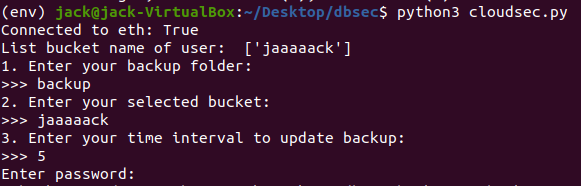
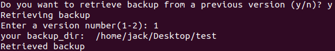
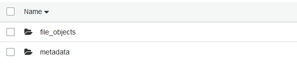

# Cloudsec

Cloudsec is a project to help Amazon S3’s users improving the security of their backup data on their shared S3 buckets.

- [Motivation](#motivation)
- [Architecture](#architecture)
  - [Backup Module](#backup-module)
  - [Object Database](#object-database)
  - [Cryptographic Module](#cryptographic-module)
  - [Ethereum Module](#ethereum-module)
  - [Stat Cache](#stat-cache)
- [Workflow](#workflow)
- [Implementation](#implementation)
  - [Contribution of Members](#contribution-of-members)
  - [Difficulties](#difficulties)
- [References](#references)

## Motivation
Cloud storage with Amazon S3 is the current trend of data storage. Since Amazon S3 provides simple redundancy of data, many people choose it as a place to store their backup data every day. Moreover, a significant proportion of them are secure data. However, an Amazon S3 bucket may be compromised by internal or external factors, or the bucket may be shared among multiple users, which the owner may want to separate access. In this project, we create an open source program called Cloudsec to help S3's users improve the security of their backup data on their shared S3 buckets.

## Architecture
There are five modules in our system: Backup module, Object database, Cryptographic module, Ethereum module, and Stat Cache. The architecture of Cloudsec is illustrated in the figure below.

### Backup Module
This is to (i) create backup versions from data files and upload them to the cloud, and (ii) retrieve backup versions from the cloud and recover the original data files. It acts as an interface for other entities. It queries the object database for de-duplication optimization, communicates with the cryptographic module to obtain the keys for encryption/decryption of files, and starts transactions with the Etherum module for data integrity.

### Object Database
This maintains the identifiers and hash values of all file objects, or chunks, that are stored in the backup storage. It also stores the data keys for each file object. During the backup operation, the backup module queries the object database to check by hash values whether an identical file object was created in the previous backup version in order to reduce duplication, if possible. If an identical file object is found, then the corresponding data key will be retrieved, encrypted with the corresponding control keys, and included in the new backup version. The backup module also records new file objects in the database and maintains the IDs of transactions with the blockchain, as explained below. We currently deploy the object database locally with the backup module.

### Cryptographic Module
Generation of keys and encryption and decryption of files and keys are done by this module. Data keys are the keys used to encrypt and decrypt chunks of data stored in the S3 bucket, and control keys are the keys used to encrypt and decrypt these data keys. A unique 256-bit data key is generated for each chunk of a file using Fernet, a symmetric encryption system in Python's cryptography library, and is stored within the metadata per chunk. A single unique control key is generated for each installation instance of the program with PBKDF2, hashing with SHA-256. A random salt for use with the key derivation function is generated and stored locally in the file system. Data keys are encrypted using Fernet, which uses AES encryption in CBC mode, with PKCS7 padding and a SHA-256 HMAC for authentication.

### Ethereum Module
This contains the methods to interact with the Ethereum blockchain testnet. When an encrypted backup version is uploaded to S3, a hash of the files and metadata in the version is computed and uploaded to Ethereum testnet via a transaction. This provides a method of attestation of integrity when retrieving backup versions of the data from S3 - a modification of the retrieved data will result in a different hash.

### Stat Cache
This keeps a copy of the metadata locally and is used to check if a file has been modified based on the modification time returned from the `stat()` system call. If the file has not been modified, then the backup module will directly reuse the information from the stat cache to construct the metadata of the unmodified file for the current backup version, instead of reading the objects of the unmodified file. The use of the stat cache can further improve the backup performance.

## Workflow
The workflow of Cloudsec is described in the figure below.

Before starting the program, you must:
1. Create an AWS account and download and set up the AWS CLI.
2. Create an Ethereum account and save the account address and private key.

The program is started by running file `cloudsec.py`. In the first time you run the program, it will ask you to configure a few things. Firstly, it will ask you to provide the path of the directory you wish to backup. Secondly, it will ask you which of your S3 buckets you'd like to backup to. Thirdly, it will ask you how often (in seconds) you'd like the program to check for changes in the backup directory, as shown in the figure below.

If changes are detected, they will be uploaded to S3. Each time the program has finished checking for changes, you are given the option to retrieve any version of the directory that has been uploaded so far to S3. If you choose to retrieve, you will be prompted for a directory to which to download the files, and which version you'd like to download.

The files and metadata are stored in S3 as shown in figure below.

## Implementation
### Contribution of Members
- **Tan Lam**: is the project manager, contributed the idea, designed the general architecture, implementedthe class ObjectDB, and joined other modules into BackupProgram class, the main class of the project.
- **Marcus Deng**: contributed the idea, implemented the StatCache class, developed the Ethereum andcryptographic modules, and helped debug.
- **Jack Tackett**: implemented functions to split and join files,  developed cryptographic module,  andhelped debug.- - **Dylan Yu**: implemented Metadata class and retrieval methods.

### Difficulties
- Some members lacked experience with entirely remote collaboration, hence there were some difficulties in communicating between each other at the beginning.
- We have little experience with Amazon S3, sqlite and Ethereum, but this has been an opportunity for us to study them.
- At first, our design of class ObjectDB and Metadata was not efficient, which made implementing other things difficult.
- The output of $os.stat$ is different between Windows and Linux, which made the program behave differently in different environments. It took us some time to find the issue.

## References
[http://www.cs.cuhk.edu.hk/~cslui/PUBLICATION/cloudsec11.pdf](http://www.cs.cuhk.edu.hk/~cslui/PUBLICATION/cloudsec11.pdf)
[https://cryptography.io/en/latest/fernet.html](https://cryptography.io/en/latest/fernet.html)
[https://cryptography.io/en/latest/hazmat/primitives/key-derivation-functions.html](https://cryptography.io/en/latest/hazmat/primitives/key-derivation-functions.html)